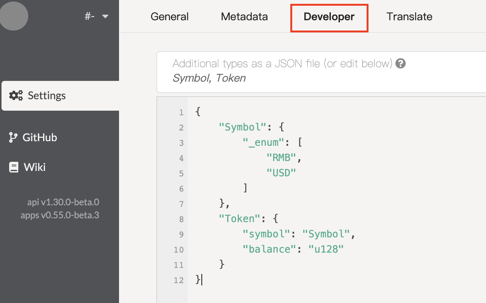
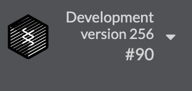
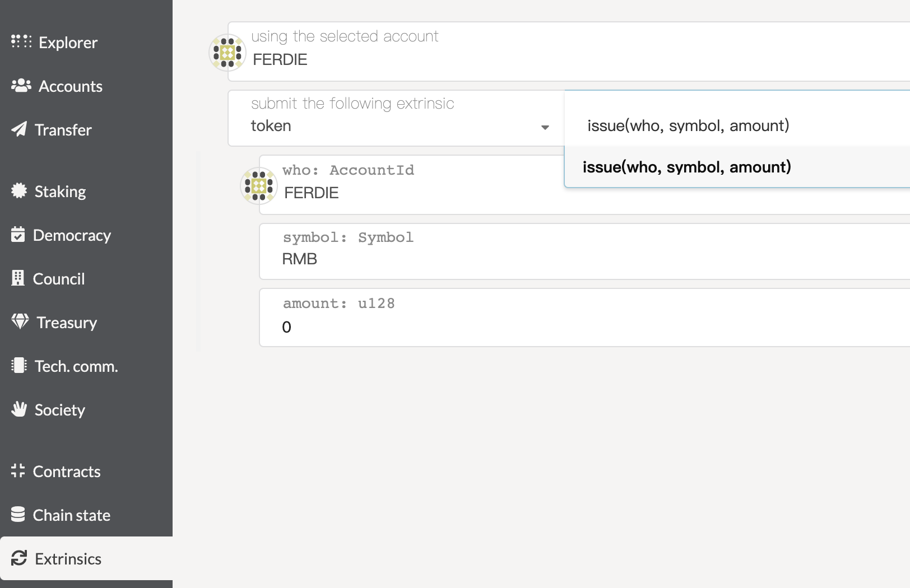
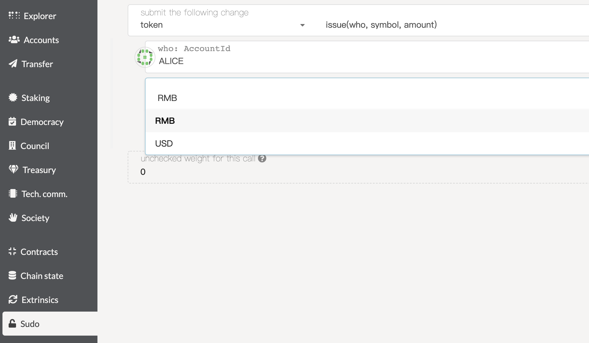
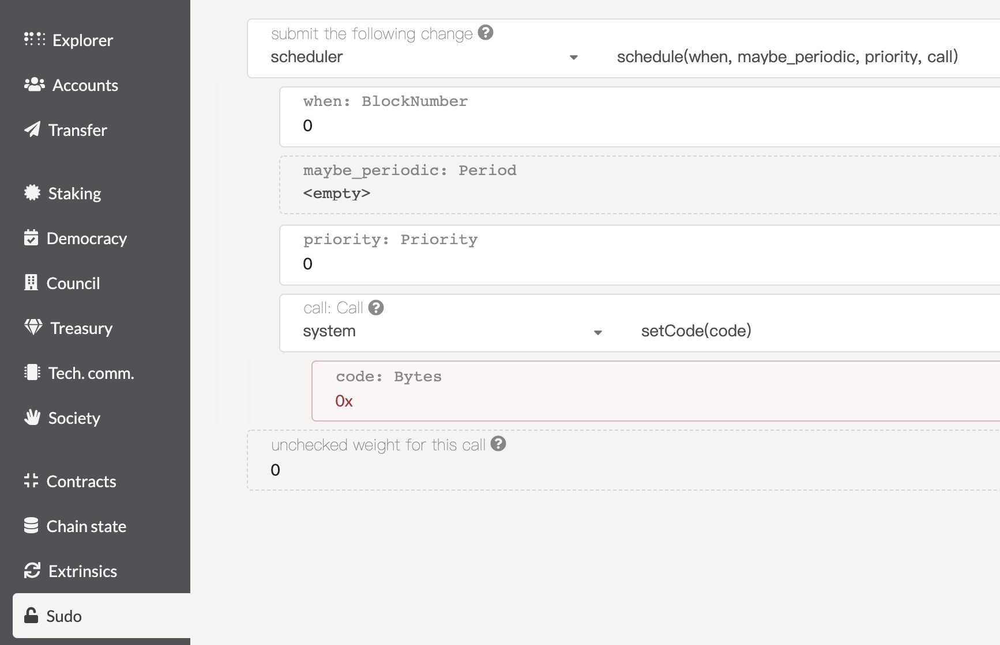
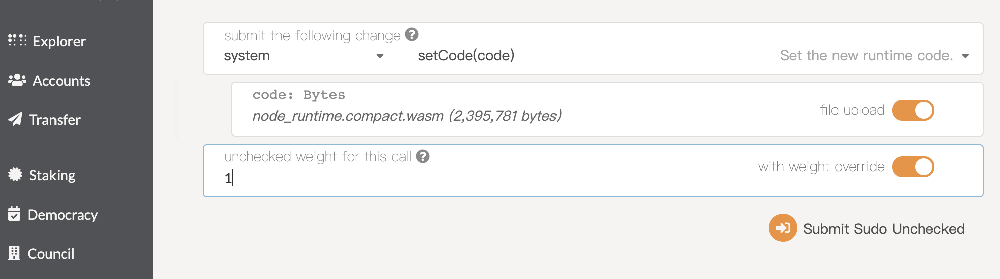
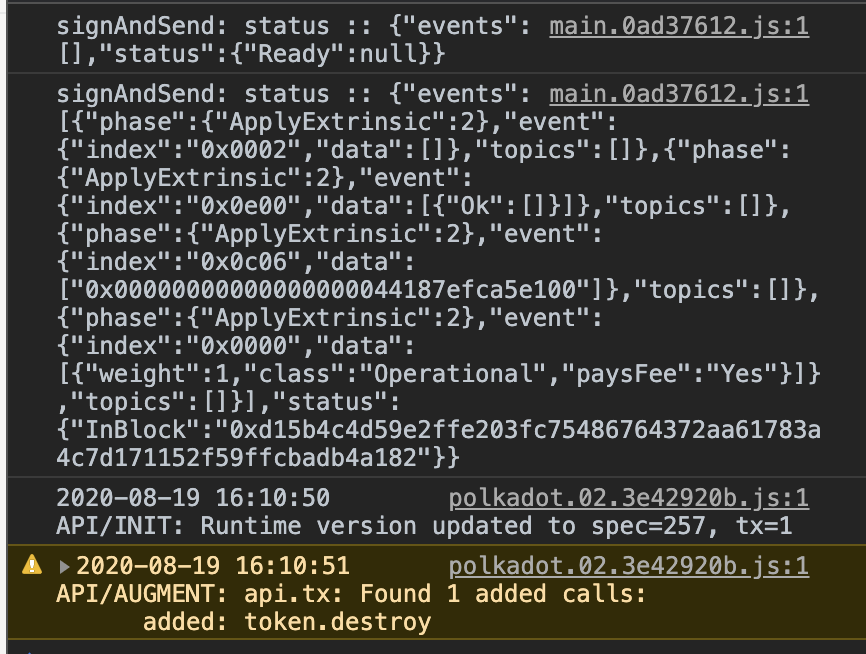

## Substrate的Runtime升级和去耦合

> 所有示例代码都在这个仓库: [816](https://github.com/Dengjianping/816/tree/jamie816)，且是目前最新[RC5](https://github.com/paritytech/substrate/tree/v2.0.0-rc5%2B2)。和文章相关的代码在这个文件夹下[demo](https://github.com/Dengjianping/816/tree/jamie816/demo)。

### Runtime的升级

##### 为什么是webassembly
首先，Substrate是使用Rust和webassembly构建的，而编写的Runtime会编译成wasm文件，而这个生成的wams能够执行在VM上，从而做到无叉升级。

其次，webassembly有诸多优点。
- 高性能。编译出来的wasm在执行时，执行指令接近底层硬件，所有运行速度很快。
- 沙盒。Webassembly执行在VM上，所有可以做到隔离和热处理等等。
- 良好的社区支持。工具链和生态得到了社区的大力支持，比如目前rust对webassemly支持地最好。
- 还有一些其他的优点，比如跨平台，更好的安全性等等。

##### 为什么要在Subtrate开发中做Runtime升级
- 安全性。当发现链上代码有安全问题，为了能够及时把问题修补，在线上做Runtime的升级时非常必须的。
- 添加新的接口或者特性。
- 性能。当我们对Runtime模块进行了性能优化，升级Runtime也是必要的。

##### 升级Runtime的一些规则

截取最新[RC5](https://github.com/paritytech/substrate/blob/v2.0.0-rc5%2B2/bin/node/runtime/src/lib.rs#L100)相关Runtime的代码。
```rust
/// Runtime version.
pub const VERSION: RuntimeVersion = RuntimeVersion {
    spec_name: create_runtime_str!("node"),
    impl_name: create_runtime_str!("substrate-node"),
    authoring_version: 10,
    // Per convention: if the runtime behavior changes, increment spec_version
    // and set impl_version to 0. If only runtime
    // implementation changes and behavior does not, then leave spec_version as
    // is and increment impl_version.
    spec_version: 256,
    impl_version: 0,
    apis: RUNTIME_API_VERSIONS,
    transaction_version: 1,
};
```

这里，和Runtime升级有关的字段有两个：
- spec_version。比如当有新的接口增加或者删减，从而导致Runtime有共识逻辑上的变化，就需要+1。当做升级时，新版本的Runtime的 spec_version 高于当前运行版本的spec_version，这时链上就会升级到最新的Runtime。
- impl_version。这个更多的是非共识逻辑变化的修改，比如对某个接口进行性能优化，优化并不好导致这个接口的输出会发生变化。
- 其余字段的解释可以阅读这篇文章[Runtime Execution](https://substrate.dev/docs/en/knowledgebase/advanced/executor)。

##### 示例

示例的代码编译自这里：[816](https://github.com/Dengjianping/816/tree/jamie816)，编译整个工程，最好是在release模式下。

当前示例包含一个模块Token，包含两个接口[issue](https://github.com/Dengjianping/816/blob/jamie816/demo/token/src/lib.rs#L45) && [destroy](https://github.com/Dengjianping/816/blob/jamie816/demo/token/src/lib.rs#L74)，这两个接口分别可以发行，销毁token，且都只能拥有sudo权限的用户才能操作。

1. 修改[spec_version](https://github.com/Dengjianping/816/blob/jamie816/bin/node/runtime/src/lib.rs#L108)为256，编译生成只包含issue接口的native node。注释[Line 45]() 到 [Line 89 ](https://github.com/Dengjianping/816/blob/jamie816/demo/token/src/lib.rs#L89)，然后编译工程。
```shell
cargo build --release
cp target/release/substrate . # 拷贝当前编译native binary到当前目录，避免下次编译被覆盖
```

2. 修改[spec_version](https://github.com/Dengjianping/816/blob/jamie816/bin/node/runtime/src/lib.rs#L108)为257，编译工程生成包含issue和destroy接口的wasm文件，把[Line 45]() 到 [Line 89 ](https://github.com/Dengjianping/816/blob/jamie816/demo/token/src/lib.rs#L89)的注释去掉，然后编译工程。
```shell
# 生成wasm路径：target/release/wbuild/node-runtime/node_runtime.compact.wasm
cargo build --release
```

3. 升级。

运行节点
```shell
./substrate --dev
```
访问前端工具[polkadot.js.org](https://polkadot.js.org/apps/#/extrinsics)，发现前端页面无法加载节点的数据，
把[types.json](https://github.com/Dengjianping/816/blob/jamie816/demo/types.json)的数据类型拷贝到截图显示部分，保存后，刷新页面。



可以看到前端已经能够加载后端了。
先查看一些前端显示的数据。看看spec_version。



目前显示的版本是256。再查看下token模块的交易接口



目前也只有一个issue接口，没有destroy接口。

这个时候给用户，比如Alice发行一些RMB和USD，注意要在sudo权限下操作。



发行成功后，可以取chain state下查询Alice的token详情。以便升级后做一些操作。

接下来我们来做一次升级。升级有两种方式。
- set_code。这个在做本地或者测试网测试使用，快速且方便。不推荐线上服务通过这个接口升级Runtime。
- scheduler + set_code。这个升级方式更加合理和弹性，可以在某个块高度，或者周期，优先级上进行升级设置，而且不会造成链上资源的过度消耗。



我们就直接使用set_code来进行升级，且把浏览器的console打开，升级过程会有相应的events和log出现。

> Tips：升级都需要在sudo权限执行。



按照截图升级Runtime，提交后注意观察浏览器console的输出。

如果一切正常，升级完成后，可以看到左上角的版本号变成了257，浏览器的console也会提醒新加了destroy这个接口。



现在可以去试试调用destroy接口去销毁Alice的一些token，这里就不赘述了，读者可以自己。记得还是需要在sudo权限下执行。

如果读者有时间，可以去做一些实验。
- 用scheduler来升级。
- 修改impl_version，然后进行升级。

### Runtime模块的去耦合

##### 为什么要去耦合
- 冗余。随着工程规模的增加，内部模块和代码的关系会变得复杂。
- 代码可读性。
- 调试的便捷性。

##### 耦合情况
当前模块想读取关联模块的storage，可能的定义和调用如下
```rust
// 定义trait
pub trait Trait: frame_sysmte::Trait + module1::Trait + module2::Trait + ... {
   type Event: From<Event<Self>> + Into<<Self as system::Trait>::Event>;
   ...
}

// 读取和写入
{
   ...
   // 读取
   let module1_value = <module1::ModuleStorage1<T>>::get(key1);
   let module2_value = <module2::ModuleStorage2<T>>::get(key2);
   // 写入
   <module1::ModuleStorage1<T>>::mutate(&key1, |val| {
       // ...
   });
   <module2::ModuleStorage2<T>>::mutate(&key2, |val| {
       // ...
   });
   ...
}
```
还有我们得在Cargo.toml里导入对应的模块。

但当这样的关联的模块越来越多的时候，代码的可读性就降低了，模块直接的关系愈发复杂，依赖性逐渐升高，也不方便维护了。

所以我们就可以考虑模块之间的去耦合。

##### 如何去耦合

还是拿前面那个例子做参考：token模块可以给用户发行token，所以我们希望有个模块可以兑换不同的token。例子里有个exchange模块，就是去耦合方式读写token里的storage。

参照一下几个步骤就可以去耦合。

1. 定义一个trait。

代码可以参考[primitives](https://github.com/Dengjianping/816/blob/jamie816/demo/token-primitives/src/lib.rs#L27)
```rust
pub trait TokenTrait<AccountId> {
   fn decrease(who: &AccountId, symbol: Symbol, amount: u128);
   fn increase(who: &AccountId, symbol: Symbol, amount: u128);
   fn get_token(who: &AccountId, symbol: Symbol) -> Token;
   fn has_token(who: &AccountId, symbol: Symbol) -> bool;
}
```
2. 在token模块实现这个trait。

代码可以参考[token](https://github.com/Dengjianping/816/blob/jamie816/demo/token/src/lib.rs#L94)模块部分
```rust
impl<T: Trait> token_primitives::TokenTrait<T::AccountId> for Module<T> {
    fn decrease(who: &T::AccountId, symbol: Symbol, amount: u128) {
        <AccountToken<T>>::mutate((who, symbol), |token| {
            token.balance = token.balance.saturating_sub(amount);
        });
    }

    fn increase(who: &T::AccountId, symbol: Symbol, amount: u128) {
        <AccountToken<T>>::mutate((who, symbol), |token| {
            token.balance = token.balance.saturating_add(amount);
        });
    }

    fn get_token(who: &T::AccountId, symbol: Symbol) -> Token {
        <AccountToken<T>>::get((who, symbol))
    }

    fn has_token(who: &T::AccountId, symbol: Symbol) -> bool {
        <AccountToken<T>>::contains_key((who, symbol))
    }
}
```

3. 在exchange的trait定义里注册这个trait handler。

代码可以参考[token-exchange](https://github.com/Dengjianping/816/blob/jamie816/demo/token-exchange/src/lib.rs#L9)模块部分
```rust
// 定义部分
pub trait Trait: frame_system::Trait {
    type Event: From<Event<Self>> + Into<<Self as frame_system::Trait>::Event>;
    
    // 关键部分之一，定义一个类型实现了TokenTrait
    type TokenTrait: TokenTrait<Self::AccountId>;
}

// 读写部分
{
    ...
    ensure!(
        T::TokenTrait::get_token(&exchanger, exchange_symbol).balance >= amount,
        Error::<T>::ExchangeTooMuch
    );
    T::TokenTrait::decrease(&exchanger, exchange_symbol, amount);
    T::TokenTrait::increase(&exchanger, target_symbol, rmb);
    ...
}
```

4. 在Runtime里关联上这两个模块。

代码可以参考[Runtime](https://github.com/Dengjianping/816/blob/jamie816/bin/node/runtime/src/lib.rs#L842)模块部分

```rust
impl token::Trait for Runtime {
    type Event = Event;
}

impl token_exchange::Trait for Runtime {
    type Event = Event;
    // 这是关键步骤，这个Token类型就是下面construct_runtime宏生成的
    type TokenTrait = Token;
}

construct_runtime!(
    pub enum Runtime where
       Block = Block,
       NodeBlock = node_primitives::Block,
       UncheckedExtrinsic = UncheckedExtrinsic
    {
        …
       Token: token::{Module, Call, Storage, Event<T>},
       TokenExchange: token_exchange::{Module, Call, Storage, Event<T>},
    }
);
```

这样，几个步骤下来，就可以降低模块之间的耦合度。而且使用时只需要调用接口即可，不需要关注实现细节。当接口实现需要变动时，也只需要修改接口实现部分，调用模块无需再次作出修改，耦合情况下，就得多处修改。

现在可以去tokenExchange这个模块下的exchange接口进行交易，看能不能修改token的数据。

### 结语
如果读者发现文章有不对地方或者建议，欢迎提出，避免误导大家，谢谢！

努力学习Rust和Substrate吧！